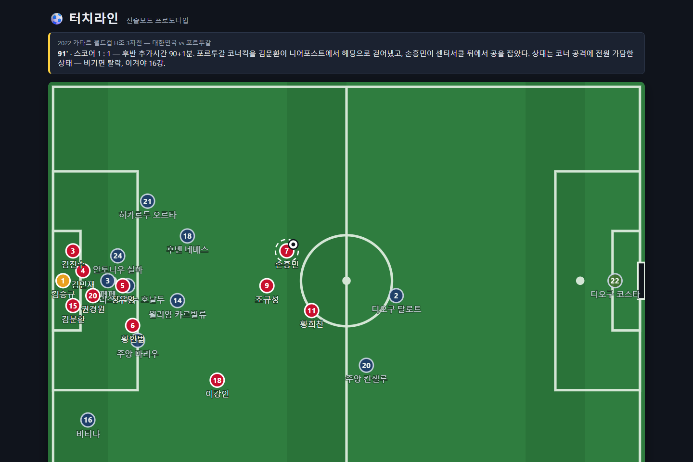
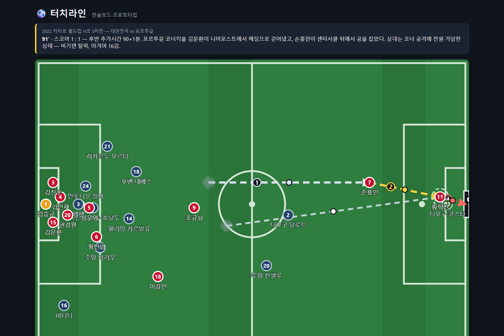
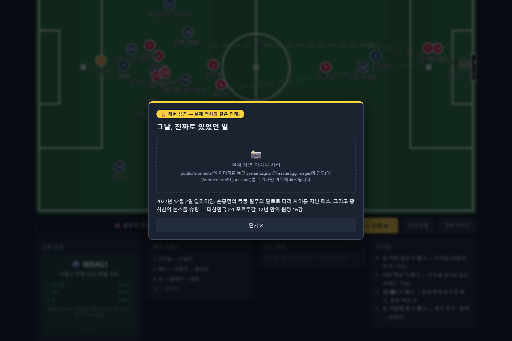

# ⚽ 터치라인 — "당신이 히딩크였다면?"

DAKER 월간 해커톤 「내가 축구 감독이라면 — 월드컵 전술 웹서비스 챌린지」 출품작.

실제 월드컵 명경기의 결정적 순간으로 돌아가, 전술보드 위에서 드리블·패스·슛·오프볼 런을
직접 설계하고 그 전개가 성공했을지를 확률 엔진으로 판정받는 웹 게임입니다.
백엔드 없는 클라이언트 완결형(Vite + React + SVG)이고, 시드 PRNG라 같은 링크(`?seed=`)면
누구에게나 같은 결과가 재현됩니다.

## 실행

```bash
npm install
npm run dev      # 개발 서버
npm run build    # 배포 빌드
npm run lint     # oxlint
```

## 시나리오 — 90+1분, 그 순간의 재현

현재 시나리오는 **2022 카타르 월드컵 H조 3차전 대한민국 vs 포르투갈, 후반 추가시간
90+1분의 역습**입니다. 배치는 실제 장면 그대로: 포르투갈 코너킥을 김문환이 니어포스트에서
걷어내고 손흥민이 센터서클 뒤에서 공을 잡은 순간. 포르투갈은 코너 공격에 전원 가담한
상태라 잔류 수비는 달로트·칸셀루(+골키퍼 코스타)뿐입니다. 온필드 명단도 그 시점
그대로라, 66분에 이재성 대신 교체 투입된 **황희찬**이 그라운드에 있습니다.



## 이스터에그 — "그날, 진짜로 있었던 일"

실제 역사와 같은 전개로 골을 넣으면 팝업이 뜹니다. 판정 조건은 세 가지뿐:
**마지막 패스가 손흥민 → 황희찬**이고, **마지막 슛을 황희찬**이 쐈고, **결과가 GOAL**.
드리블 횟수나 궤적 곡선은 자유입니다 (`scenarios.json`의 `easterEgg.passerId/scorerId`로
판정하므로 다른 모먼트에도 재사용 가능).

### 재현 레시피 — 이렇게 구상하면 됩니다

1. **황희찬을 페널티박스 안**(페널티스팟 부근)으로 드래그 — 침투 런
2. **손흥민(공 소유)을 박스 근처(x≈90)까지 드래그** — 실제의 40m 질주처럼 깊게.
   엔진이 긴 패스(−0.0917/m)를 긴 드리블(−0.06/m)보다 크게 감점하므로,
   거리는 드리블로 벌고 패스는 짧게 가져가는 게 유리합니다
3. **공(⚪)을 황희찬 쪽으로 드래그하되 골문 존(x≥106) 바깥에서 놓기** — 존 안에 놓으면
   무조건 슛으로 판정되고, 존 밖에서 놓으면 9m 이내 가장 가까운 동료에게 패스로 스냅됩니다
4. **공을 골문으로 드래그** — 슛
5. **전술 확정 — 실행 ▶**

이렇게 구상하면 계획 화면이 이렇게 나옵니다 — 황희찬 침투 런(점선), 손흥민 드리블 ①,
스루패스 ②, 논스톱 슛 ③:



이 플랜의 전체 성공 확률은 약 15%(개별 43% · 65% · 53%)입니다. 시연·발표·공유용으로는
**`?seed=50843`** 을 붙이세요 — 이 시드는 앞 세 굴림이 전부 0.033 이하로 나와, 위 3액션
플랜이면 드래그가 다소 어긋나도 사실상 항상 골까지 재현됩니다 (좌표 ±3m 흔들어 100회
시뮬레이션 전부 GOAL 확인).

골이 들어가면 재생이 끝난 뒤 팝업이 뜹니다:



### 팝업에 실제 장면 이미지 넣기

- `public/moments/`에 이미지를 넣고 `scenarios.json`의 `easterEgg.images`에
  `"/moments/파일명.jpg"`처럼 경로를 추가하면 플레이스홀더 자리에 순서대로 표시됩니다.
- ⚠️ **저작권**: 실제 중계 화면 캡처(유튜브 캡처 포함)는 FIFA·중계권사의 저작물이라
  공개 출품작에 넣으면 리스크가 있습니다. 직접 제작/생성한 일러스트 이미지를 권장합니다.

## 프로젝트 구조

```
src/
├── data/                  ← 데이터 담당 팀원 작업 영역
│   ├── players.json         선수 데이터 (능력치 포함)
│   ├── scenarios.json       경기 시나리오 (재현할 "순간" 정의)
│   └── formations.json      포메이션별 기본 배치 좌표
├── engine/                ← 수식 담당 팀원 작업 영역 (React 몰라도 됨)
│   ├── constants.js         CALC_SPEC v2 확정 계수 — 모든 매직넘버는 이 한 파일
│   ├── resolve.js           확률 판정 엔진 — 로그오즈 가법 + 로지스틱 (CALC_SPEC v2)
│   ├── match.js             궤적 매칭 점수 — 가우시안 커널 σ=3 (아직 UI 미연결)
│   ├── geometry.js          베지어 궤적·최단거리 등 기하 공통 부품
│   ├── playback.js          판정 결과 → 재연 애니메이션 (순수 연출, 판정과 무관)
│   └── commentary.js        중계 자막 멘트 풀
├── components/
│   └── TacticsBoard.jsx     SVG 전술보드 (드래그 입력·렌더링)
└── App.jsx                  상태 관리 + 화면 조립
```

**경계 규칙**: UI는 `resolveSequence(actions, ctx) → { pTotal, outcome, steps, reason, seed }`
시그니처에만 의존합니다. 수식 내부를 아무리 바꿔도 이 입출력 형태만 유지되면 UI는 안 깨집니다.

## 팀원별 작업 가이드

### 선수 데이터 (`src/data/players.json`)

**v2.1부터 데이터담당 CSV(1~20 스케일, 16스탯 + 키)가 정식 반영됐습니다.** 항목 예시:

```json
{
  "id": "kor_07", "name": "손흥민", "team": "KOR", "number": 7,
  "position": "FW", "roles": ["LW", "ST"], "heightCm": 183,
  "stats": {
    "flair": 17, "finishing": 16, "dribbling": 11, "longshots": 16,
    "crossing": 12, "passing": 12, "heading": 5, "strength": 10,
    "acceleration": 15, "pace": 15, "jumping": 10, "balance": 12,
    "marking": 5, "tackle": 6, "positioning": 7, "anticipation": 15
  },
  "overall": 85, "condition": 100
}
```

- 스탯 키 ↔ CSV 헤더: 개인기=flair · 골결=finishing · 드리블=dribbling · 중거리=longshots ·
  크로스=crossing · 패스=passing · 헤더=heading · 몸싸움=strength · 가속도=acceleration ·
  주력=pace · 점프거리=jumping · 균형감각=balance · 일대일마크=marking · 태클=tackle ·
  수비위치선정=positioning · 예측력=anticipation. `norm()`은 부록 A대로 `v/20` 어댑터로 교체됨.
- 필드가 없으면 데이터담당 CSV(`worldcup_2026_stats.csv`) 원본값입니다.
  `estimated: true` = 사람이 손으로 넣은 추정치(현재 83명). **화면에는 표시하지 않습니다** —
  플레이어에게 "이 값은 대충이다"를 알릴 이유가 없어서 뺐습니다. 데이터 안에만 남겨
  무엇을 확정값으로 바꿔야 하는지 표시해 두는 용도입니다. 2026 명단에 없는 2022 출전
  선수(권경원·김진수·정우영·페페·안토니우 실바·윌리암 카르발류·주앙 마리우·오르타)와
  CSV에 없는 교체 선수가 여기 해당합니다 — 데이터담당이 확정값으로 교체해 주세요.
- `team`은 scenarios.json의 `home`/`away`와 매칭돼 자동으로 스쿼드가 갈립니다.
- 배열 순서 = formations.json 슬롯 순서 (GK → DF → MF → FW). 단, moment에
  `positions`가 있으면 좌표·온필드 명단 모두 positions가 우선합니다 (아래 경기 데이터
  참고) — 로스터에 벤치 선수를 넣어둘 수 있다는 뜻입니다 (현재 이재성).

### 경기 데이터 (`src/data/scenarios.json`)

```json
{
  "match_id": "kor_por_2022",
  "title": "…", "home": "KOR", "away": "POR",
  "actual": { "score": [2, 1], "formation": "4-2-3-1" },
  "moments": [{
    "id": "m91_counter", "minute": 91, "score": [1, 1],
    "situation": "상황 설명", "objective": "미션 문구",
    "ball": "kor_07",
    "positions": { "kor_01": { "x": 3, "y": 40 }, "…": "실제 장면 좌표 (양팀 전원)" },
    "easterEgg": {
      "passerId": "kor_07", "scorerId": "kor_11",
      "title": "팝업 제목", "caption": "팝업 설명 문구", "images": ["/moments/….jpg"]
    }
  }]
}
```

- `ball` = 그 순간 공을 소유한 선수 id (전개의 시작점).
- `positions` = 그 순간의 실제 좌표 (120×80 피치 기준). **있으면 여기 등재된 선수만
  그라운드에 섭니다** — 즉 온필드 명단을 겸하므로 교체(예: 90+1분의 황희찬 인/이재성
  아웃)를 데이터만으로 표현합니다. 로스터의 나머지는 자동으로 벤치. 없으면
  formations.json 기본 배치로 폴백.
- `easterEgg` (선택) = 실제 경기 재현 판정과 팝업 내용. `passerId → scorerId` 마지막
  패스 + `scorerId`의 골이면 발동. `images`는 `public/` 기준 경로 배열(비어 있으면
  플레이스홀더 표시).
- 지금은 첫 번째 moment만 로드합니다. 스테이지 시스템이 붙으면 moment 배열이 그대로
  스테이지 목록이 됩니다.

### v2.1 변경 요약 (데이터 반영 + 수비 재배치)

v2 산식 위에 데이터담당 요청사항과 수비 이동을 얹은 업데이트입니다.
검증은 `node scripts/verify.mjs` — 보고서 v2 앵커 15개(스탯 중립 기준 유지) + 신규 메커니즘.

| 변경 | 내용 | 파일 |
|---|---|---|
| FM 1~20 이관 | `norm(v)=0.3+0.7·v/20` 어댑터 교체, players.json 16스탯 | resolve.js, players.json |
| 발 슛 | S_eff = **골결**(finishing) 단독 ("발로 찰 땐 골결") | resolve.js `calcShot` |
| 중거리 | 거리 감쇠 완화: `B_DIST × (1 − 0.5·(norm(중거리)−0.7))` | `K.SHOT.LS_RELIEF` |
| 크로스 | 측면→박스 18m+ 패스는 **크로스 스탯** + 예측력 보정 | `K.CROSS`, `calcPass` |
| 헤더 | 크로스 직후 슛 = 헤더: 골결:헤더 **3:7** + 공중 듀얼(점프 50%+키 30%+몸싸움 20%) | `calcShot` |
| 수비 스탯 | 압박 β를 수비수별 스케일: 패스차단=**수비위치선정**, 드리블=**마크+태클**, 블록=마크. **예측력 50% 상시 혼합** | `defScale` |
| 몸싸움 듀얼 | 드리블 1v1에 (몸싸움+균형)/2 차이를 접촉 강도 비례로 가산 | `K.DRIB.B_BODY` |
| **수비 재배치** | 액션마다 수비수가 볼에 반응해 이동(압박/마킹/조널 + 이동 시간 예산) → 다음 액션은 새 좌표로 판정. **수비 붕괴가 상수가 아니라 기하에서 창발** — 미끼로 끌고 반대로 전환하면 쉬워지고, 밀집지 재진입은 어려워짐 | **defense.js (신규)** |
| FLOW 축소 | 수비 붕괴 상수 0.25 → 0.1 (잔여 "기세"만 담당) | `K.SEQ` |
| 연출 | 수비수가 판정 웨이포인트(steps[k].defPos)를 향해 조향 + 모든 말에 **바라보는 방향 화살표** (FM식) | playback.js, TacticsBoard.jsx |
| 오프볼 연출 | **지원 런**(공 근처 아군 3명이 앞 공간 침투) · **수비 셰도잉**(웨이포인트 복귀 후 근처 공격수 골사이드 추적, 판정 좌표 ±3m) · **템포**(공 속도에 비례해 오프볼 전원 속도 1.0~1.9×) — 전부 판정과 무관한 순수 연출 | playback.js |
| 시네마틱 | 슛 **슬로모션**(0.35배속 시간 워프 + 비네트) · **스크린 셰이크**(슛/차단/골) · **골 플래시** · **볼 트레일**(빠른 패스·슛 혜성 꼬리) · **GK 다이브** | playback.js, App.jsx/css |

### 판정 수식 (`src/engine/resolve.js` + `constants.js`) — CALC_SPEC v2

> 기준 문서: 계산식 담당의 **「산식확정 보고서 v2」(2026-07-18)**. 이 섹션은 그 보고서의
> 산식이 코드에 어떻게 들어갔는지를 팀 전체가 읽을 수 있게 풀어쓴 것입니다.
> v1 시절 이슈(② M_def 방향버그, ⑤ P^(1/n) 불일치, SHOT_SCALE 임의 보정)는 v2로
> 이관하면서 전부 해소/폐기됐습니다.

#### 0. 큰 그림 — 곱셈식에서 로그오즈로

v1 엔진은 `능력치 × 거리감쇠 × 수비감쇠` 같은 **확률 곱셈**이었습니다. v2는 분야 표준
구조인 **로그오즈(log-odds) 가법**으로 바뀌었습니다:

```
z = (기본 절편) + (거리 항) + (각도 항) + (스킬 항) + (수비 압박 항들)   ← 전부 "더하기"
P = clamp( σ(z) ),  σ(z) = 1/(1+e^−z),  clamp = [0.02, 0.97]
```

왜 이렇게 하나 (보고서의 비유 그대로): 확률(0~100%)은 "좁은 방"이라 보너스를 직접
더하거나 곱하면 120%, −5%처럼 벽을 뚫습니다. 로그오즈는 벽이 없는 −∞~+∞ 점수판이라
거리·각도·스킬·압박을 마음껏 가감해도 안 터지고, 마지막에 S커브(로지스틱 σ)가 다시
0~100%로 접어 넣습니다. **z에 더하기 = 오즈(성공:실패 비)에 곱하기**라서
(`ln(a·b)=ln a+ln b`), 예컨대 슛 경로 위 블로커의 −2.5는 "오즈 ×0.08"과 같은 뜻입니다.

감 잡기용 환산표:

| 확률 P | 50% | 25% | 75% | 10% | 90% |
|---|---|---|---|---|---|
| 로그오즈 z | 0 | −1.10 | +1.10 | −2.20 | +2.20 |

전역 규칙 (`constants.js`):

- **`norm(v) = 0.3 + 0.7·(v/100)`** — 스탯 0~100 → [0.3, 1.0]. 하한 0.3은 "저능력
  선수도 최소 기여"라는 게임디자인 floor(문헌 근거 아님, 설계 선택 — 보고서 부록 B).
  FM 1~20 데이터로 바뀌면 이 줄만 `v/20`으로 교체.
- **전역 clamp(0.02, 0.97)** — 어떤 판정도 0%·100%가 없다. 기적과 실수의 여지.
- **결정론** — `mulberry32(seed)` 단일 난수열을 판정 순서대로 소비. 같은 전술+같은
  시드 = 항상 같은 결과 (`?seed=` 링크 재현). **판정 순서를 바꾸는 리팩토링 금지.**
- **수비 압박은 전 액션 공통** `pressure(d, R) = e^(−d/R)` — v1의 "오라 안/밖" 이진
  판정을 폐기한 연속 감쇠(소프트 프레셔). d는 수비수-경로 최단거리, R은 액션별 반경.
  로그오즈에 `β(<0) × pressure`로 더해지므로 "가까울수록 큰 감점"이 구조적으로 보장됨.

#### 1. 슈팅 — 로지스틱 xG (`calcShot`)

```
z = B0 + B_DIST·D + B_ANG·θ + B_SKILL·(S_eff − 0.70) + Σᵢ B_BLOCK·e^(−dᵢ/R_BLOCK)
S_eff = norm(shooting) × (0.7 + 0.3·norm(composure))
```

| 항 | 종류 | 뜻 |
|---|---|---|
| `D` | 변수 | 슈터 → 골 중앙 (120, 40) 거리(m). 멀수록 불리 |
| `θ` | 변수 | 양 포스트 (120, 36.34)·(120, 43.66) 사잇각(라디안). 정면·근거리일수록 큼 |
| `S_eff` | 변수 | 슈팅 능력 × 침착 보정. 0.70이 "평균" 중심점 |
| `dᵢ` | 변수 | i번째 **필드 수비수**의 슛 경로 최단거리. **GK는 제외** |
| `B0=−0.9702, B_DIST=−0.1111/m, B_ANG=+1.0659/rad, B_SKILL=+2.0, B_BLOCK=−0.75, R_BLOCK=2.0m` | 계수 | constants.js `K.SHOT` |

- **GK 제외는 꼼수가 아니라 이중계상 방지**: 로지스틱 xG의 계수 자체가 "평균 골키퍼가
  있는 세계"에서 캘리브레이션된 값이라, GK를 블로커로 또 세면 키퍼를 두 번 반영하는 셈.
- v1의 `SHOT_SCALE=2.2`(재미 보정)는 **삭제** — base rate는 절편 B0가 직접 정한다.
- `K.SHOT.PENALTY_XG=0.76`은 페널티킥 특례 상수(현재 PK 상황이 없어 미사용, 상수만 준비).

중앙 정면 슛의 기대값 (스킬 중립·수비 없음 — 구현 검증치):

| 거리 D | 5.5m (6yd) | 11m (12yd) | 16.5m (18yd) | 23m (25yd) |
|---|---|---|---|---|
| xG | 0.42 | 0.18 | 0.09 | 0.04 |

#### 2. 패스 — 로그오즈, 리시버 지배 (`calcPass`)

```
z = Z0 + B_LEN·L + B_PASS·(S_pass − 0.70)
       + B_RECV·e^(−d_recv/R_RECV)      ← 리시버 압박 (지배 레버)
       + Σⱼ B_LANE·e^(−dⱼ/R_LANE)       ← 경로 압박 (보조)
S_pass = norm(passing) × (0.85 + 0.15·norm(vision))
```

| 항 | 종류 | 뜻 |
|---|---|---|
| `L` | 변수 | 궤적 **호 길이**(m). 곡선으로 휘면 자연히 길어져 페널티 — 곡선 특례식 없음 |
| `d_recv` | 변수 | **도착점** 최근접 수비수 거리. 리서치 최대 교훈: 완성률을 지배하는 건 패스 거리가 아니라 받는 지점의 수비 기하 |
| `dⱼ` | 변수 | 경로상 수비수들의 경로 최단거리 |
| `Z0=+2.933, B_LEN=−0.0917/m, B_PASS=+1.5, B_RECV=−2.0, R_RECV=4.0m, B_LANE=−1.0, R_LANE=3.0m` | 계수 | constants.js `K.PASS` |

기대값 (구현 검증치): 무압박 8/20/30m → **0.90 / 0.75 / 0.55**.
20m 패스에 마크맨이 도착점 0.5/2/8m에 있으면 → **0.34 / 0.47 / 0.70**.

> ✅ **계산 담당 확인 완료 (2026-07-18)**: β_recv는 최근접 수비수 1명을 반영하는 항이고,
> **2명째부터는 경로(lane) 항으로 추가 감점**하는 게 맞다고 확인받음. 구현도 동일 —
> 도착점 최근접 수비수는 리시버 항에만 넣고 lane 합산에서는 제외(`excludeId`)해서
> 같은 수비수가 두 번 감점되는 일이 없다.

#### 3. 드리블 — 1v1, 기하 지배 (`calcDribble`)

```
z = Z0d + B_SKILL·(S_drib − 0.70) + B_LEN·L + B_DEF·e^(−d_def/R_DEF)
S_drib = norm(dribbling)          ← dribbling 스탯 없으면 (pace+composure)/2 폴백
```

- `d_def`는 **경로 최근접 수비수 1명**의 거리 (합산 아님 — 1v1 대면 모델).
- 능력치 가중 `B_SKILL=+1.2`는 의도적으로 약함: 리서치상 1v1은 예측력이 낮고(AUC≈0.69)
  간격·압박 같은 기하가 개별 능력치보다 결과를 좌우 → "노이즈 크게, 능력치는 modifier".
- 계수: `Z0d=+2.2, B_LEN=−0.06/m, B_DEF=−2.2, R_DEF=3.0m` (constants.js `K.DRIB`).
- 기대값 (L=6m, 스킬 중립, 수비 1명 간격 0.5/2/3/5m): **0.49 / 0.67 / 0.74 / 0.81**
  — 근접 1v1 ≈ 50%가 리서치 base rate와 일치.

#### 4. 시퀀스 — 판정과 보상의 분리 (`resolveSequence`)

**판정 층 (구현됨)**: 각 액션을 순서대로 `rng() < P_k`로 굴리고 **첫 실패에서 중단**
(물리적으로 정직한 생존확률 ∏). 단, 순수 ∏P는 액션 간 독립을 가정해 긴 전개를 실제보다
과하게 붕괴시키므로(0.7⁵ = 0.17), **수비 붕괴 계수**로 조건부 보정합니다:

```
z_k += min( FLOW × (직전 연속 성공 수), FLOW_MAX )     // FLOW=0.25, FLOW_MAX=2.0
```

연속 성공이 쌓이면 수비가 흔들려 다음 액션이 쉬워진다는 메커니즘 기반 보정 — 4번째
액션이면 +0.75(오즈 ×2.1), 5번째면 +1.0(×2.7). v1의 근거 없는 `P^(1/n)` 뭉개기는
**폐기**. FLOW=0.25는 프로토타입 시작값이며 플레이테스트 밸런싱 대상입니다(너무 크면
"한 번 뚫리면 무조건 골"이 되므로 상한 FLOW_MAX 필수).

- 결과 패널의 `pTotal` = "첫 실패 없이 끝까지 갔을 때"의 ∏P_k (붕괴 보정 포함) —
  즉 **계획 전체의 성공 확률**. 첫 실패 전까지는 보정값이 실제 판정과 정확히 같습니다.
- 실패 스텝에는 압박 기여가 가장 큰 수비수가 `interceptorId`(+차단 지점 좌표)로
  귀속됩니다 → 재연 애니메이션에서 "걔가 끊었다" 연출. 압박이 0.15 미만이면 귀속하지
  않고 그냥 "무산"(MISS) 처리.

**보상 층 (미구현 — 차기)**: "긴 전개 = 무조건 손해" 체감은 판정 보정이 아니라
**xT(Expected Threat) 가치 델타**로 풉니다. 16×12 존 그리드를 프리컴퓨트해서 각 스텝을
`xT[도착] − xT[출발]`로 채점, 실패해도 전진 가치를 부분 인정하는 "플레이 설계 점수"
(PlanScore). 튜토리얼/스테이지 채점에 쓸 예정.

#### 5. 궤적 매칭 (`match.js`) — 가우시안 커널, σ=3 확정

```
양쪽 궤적을 1m 등간격 리샘플링 ($1 Recognizer 방식 — 간격이 다르면 점수 왜곡)
s_k = e^(−d_k²/2σ²),  d_k = 유저점 k의 최근접 정답점 거리
Match% = 평균(s_k) × 100,  σ = 3.0m
```

편차 1/2/3/5m → 신뢰도 0.95/0.80/0.61/0.25. "명백한 빗나감"(≈2σ=6m)이 실패 임계
근처에 오도록 잡은 값. 임계: **≥90 완전 재현 · 70~90 부분 재현** (`K.MATCH`).
튜토리얼 스테이지(안정환 골든골 재현) 채점용 — 함수는 완성, UI 연결만 남음.

#### 6. 검증 — 보고서 앵커와 구현 대조

보고서의 검증표 **15개 앵커 전부 일치**를 확인했습니다 (슈팅 5 + 패스 무압박 3 +
리시버 압박 3 + 드리블 4, 오차 ±0.005 이내) + 수비 붕괴 보정 2개 + 시드 재현성.
계수를 만질 일이 있으면 같은 방식으로 다시 확인하면 됩니다 — 스킬 중립은
"주스탯 57.14 + 보조스탯 100"(→ `norm` 곱이 정확히 0.70)으로 만들 수 있습니다.

#### 7. 보류 항 (데이터·팀 결정 대기)

| 항목 | 내용 | 기다리는 것 |
|---|---|---|
| tackle 스케일 | 수비 β를 `β × norm(tackle)`로 — 강한 수비수일수록 압박 강하게 | 더미 tackle 필드는 이미 있음. 켜면 검증 앵커가 틀어져서 **계산 담당의 재캘리브레이션 결정** 필요 |
| 곡선 κ 트릭샷 | `κ = e^(−λ·S_technique)` 항 부활 | technique 스탯 |
| finishing/heading 슛 분기 | 땅볼 수신 → finishing, 크로스 수신 → heading | 해당 스탯 + 수신 유형 판정 |
| PK 특례 0.76 | 페널티킥 상황 | PK가 등장하는 시나리오 |
| xT PlanScore | §4 보상 층 | xT 그리드 프리컴퓨트 (차기) |

UI 참고: 드래그 중 보이는 수비 오라는 `DEF_RADIUS = 4.0`(리시버 압박 반경 R_RECV)
하나로 그립니다. 판정은 액션별 반경(2.0/3.0/4.0)의 연속 감쇠라 "경계"가 없지만,
시각 안내로는 가장 넓은 반경 하나가 낫다고 판단한 것 — 바꾸고 싶으면 resolve.js의
`DEF_RADIUS` export만 수정.

---

# 코드 해설 (아키텍처 투어)

처음 저장소를 열었을 때 코드가 어떻게 굴러가는지 이 섹션만 읽으면 따라갈 수 있게 정리했습니다.

## 전체 그림: 한 판이 흘러가는 길

```
data/*.json  ──▶  App.jsx  ──▶  TacticsBoard.jsx   (계획 단계: 드래그로 지시 입력)
 (선수/경기)      (상태 관리)      (SVG 그리기/입력)
                     │
                     │  "전술 확정" 버튼
                     ▼
              engine/resolve.js    ← 확률 계산 + 주사위 굴림 (판정, 순식간에 끝남)
                     │
                     ▼
              engine/playback.js   ← 이미 정해진 결과를 애니메이션으로 "재연"
                     │
                     ▼
              화면에 프레임 갱신 + 중계 자막 (commentary.js)
```

설계 사상 중 제일 중요한 것 하나: **판정과 연출의 완전 분리**. 확정 버튼을 누르는 순간
`resolveSequence()`가 성공/실패를 전부 계산해서 끝내고, 그 뒤에 도는 애니메이션은 이미
정해진 결과를 보여주는 연극일 뿐입니다. 애니메이션 중 선수가 어디에 있든 결과에 영향이
없습니다. 그래서 수식 작업은 resolve.js만, 연출 작업은 playback.js만 보면 됩니다.

모든 좌표는 **가로 120 × 세로 80** 가상 피치 좌표계(대략 미터 단위, x=0 우리 골대 →
x=120 상대 골대)를 씁니다. 화면 픽셀이 아니라 이 좌표로 모든 계산을 하고, SVG의
viewBox가 알아서 화면 크기에 맞춰 늘려줍니다.

## 시작점: index.html → main.jsx

[index.html](index.html)엔 `<div id="root">` 하나만 있고, [main.jsx](src/main.jsx)가
`createRoot(...).render(<App />)`로 그 div 안을 React에 맡깁니다. 이후 화면 갱신은 전부
React 담당.

## 데이터 조합 (App.jsx 상단)

```js
const homeSquad = playersData.filter((p) => p.team === scenario.home)  // KOR만 골라서
const onPitch = (squad) => (moment.positions ? squad.filter((p) => moment.positions[p.id]) : squad)
const basePlayers = onPitch(homeSquad).map((p, i) => ({ ...p, x: slots[i]?.x, y: slots[i]?.y, ...moment.positions?.[p.id] }))
const opponents = onPitch(awaySquad).map((p, i) => ({ ...p, x: 120 - (slots[i]?.x ?? 0), y: 80 - (slots[i]?.y ?? 0), ...moment.positions?.[p.id] }))
```

`{ ...p, x, y }`는 스프레드 문법 — 선수 객체를 복사하면서 좌표를 얹고, moment에
`positions`가 있으면 그 좌표가 마지막 스프레드로 덮어씁니다(등재된 선수만 그라운드에).
`byId`는 `id → 선수` 사전이라 어디서든 즉시 조회할 수 있습니다.

## geometry.js — 선과 점의 수학

- **2차 베지어 곡선**: 시작 A, 끝 B, 제어점 C로 휘어진 선을 만드는 표준 방식. 모든 궤적이
  이거고, 직선은 "제어점이 중간에 있는 베지어"로 통일 → 직선/곡선 분기가 코드에 없음.
- **`samplePath`** — 곡선을 33개 점의 폴리라인으로 근사. 곡선을 직접 다루는 대신 점
  목록으로 바꿔서 이후 모든 계산(길이·거리·공 위치)을 단순한 점/선분 문제로 만드는 게 핵심.
- **`pathLength`** — 점 사이 거리 합 = 호 길이. 휘어 가면 자동으로 길어져 거리 페널티 증가.
- **`minDistToPath`** — 수비수가 경로에서 얼마나 가까운가(스펙 ① 내적 사영을 선분마다).
  가장 가까웠던 지점의 진행률(frac)도 돌려줘서 실패 시 차단 연출 좌표로 씁니다.
- **`handleFromCtrl`/`ctrlFromHandle`** — 유저가 끄는 하얀 점(곡선 가운데)과 베지어
  제어점은 위치가 달라서 상호 변환. 제어점을 직접 끌면 곡선이 손을 안 따라와 직관성이 떨어짐.

## resolve.js — 판정 엔진 (CALC_SPEC v2)

산식 자체는 위의 [판정 수식 섹션](#판정-수식-srcengineresolvejs--constantsjs--calc_spec-v2)에
자세히 있고, 여기선 코드 구조만:

- **`mulberry32(seed)`**: 같은 시드면 항상 같은 난수열. URL `?seed=` 재현의 핵심.
- **`norm()`**: 능력치 0~100 → [0.3, 1.0] 어댑터. FM 1~20 데이터로 바뀌면 이 한 줄만 교체.
- **확률 계산 3형제** — 셋 다 같은 골격: 항들을 로그오즈 `z`에 더하고 σ(z) → clamp.
  - `calcShot`: 절편 + 거리 + 포스트 사잇각 + 스킬 + Σ블로커 압박 (GK 제외)
  - `calcPass`: 절편 + 호 길이 + 스킬 + **리시버 압박(지배)** + Σ경로 압박
  - `calcDribble`: 절편 + 스킬(약함) + 거리 + 대면 수비 1명 압박
  - 공통 부품 `pathPressure`: 경로의 33개 점마다 수비수 최단거리 → `e^(−d/R)` 소프트
    프레셔를 β와 곱해 z에 합산. 압박 기여가 가장 큰 수비수(`worst`)를 기억해 실패 시
    "걔가 끊었다" 연출로 넘김 (압박 0.15 미만이면 귀속 안 함 → MISS).
- **`resolveSequence`**: ① 각 액션 z 계산 + 수비 붕괴 보정(연속 성공 가정) → p_k —
  패널 표시용이자 판정용 (첫 실패 전까지 두 값이 동일) → ② 순서대로 `rng() < p` 주사위,
  첫 실패 뒤는 `success: null` → ③ 결과 요약(GOAL/ADVANCE/INTERCEPTED/MISS + reason).
- 계수는 전부 [constants.js](src/engine/constants.js)의 `K` 한 객체 — 밸런싱은 여기만.

## App.jsx — 상태의 심장

React 개념 세 가지만 알면 됩니다:

- **`useState`** — 바뀌면 화면도 다시 그려야 하는 변수. `set...()`을 부르면 React가 App
  함수를 다시 실행해 화면 갱신.
- **`useMemo`** — 의존값이 바뀔 때만 다시 계산하는 파생값 캐시.
- **`useRef`** — 리렌더와 무관한 보관함 (여기선 재생 취소 핸들 `playbackRef`).

상태는 딱 두 덩어리입니다:

```js
const [chainActs, setChainActs] = useState([])  // 공 전개 체인: 유저 지시의 "원본" (목표만)
const [runs, setRuns] = useState([])            // 오프볼 런 목록 (afterIndex = 출발 앵커)
```

**왜 `chainActs`(원본)와 `chain`(완성본)이 따로 있나** — 이 파일에서 제일 중요한 부분.
패스의 출발점은 "그 시점에 공 가진 선수가 서 있는 곳"인데 그건 앞선 드리블/런에 따라
달라집니다. 그래서 `useMemo` 블록이 지시 목록을 처음부터 순서대로 걸어가며 선수별 현재
위치(`pos`)를 갱신하고 각 지시에 출발점(`from`)을 채워 완성본 `chain`을 만듭니다. 같은
원리로 `runs → runLegs`, 최종 위치 `planPos`, 체인 끝에 공을 갖는 `carrierId`도 유도.
`runs`의 `afterIndex`는 "체인 몇 번째 액션 전에 출발하는 런인가"라는 앵커 — 덕분에
"주고 → 침투 → 되받기" 시간차 플레이가 표현됩니다.

지시 편집 함수들은 전부 `set...((prev) => 새배열)` 패턴입니다. React에서 배열 상태는
직접 수정하지 않고 항상 새로 만들어 넣어야 변경이 감지됩니다.

- `setDribble` — 공 가진 선수 드래그. 시작이면 새 레그 추가, 끄는 중엔 목표만 갱신
- `addPass` — 동료에 놓으면 pass, 골문 존이면 shot
- `removeChainFrom(i)` — 체인이라 i번째를 지우면 뒤도 전부 삭제 (출발점이 무너지므로)
- `setRunTarget` — 마지막 런이 이미 체인에 "소비"됐으면(그 위치로 패스를 받았으면) 새 런
  추가, 아니면 기존 런 조정

확정 버튼(`handleConfirm`)은 판정 → `setPhase('playing')` → `playSequence` 시작.
`phase`가 `plan → playing → done`으로 흐르고, 재생 중엔 playback이 매 프레임
`setFrame`으로 좌표를 흘려보내면 보드가 그 좌표로 그립니다.

## TacticsBoard.jsx — 입력과 그리기

하나의 큰 `<svg viewBox="0 0 120 80">`. `toPitch()`가 마우스 픽셀 좌표를 비율로 나눠
피치 좌표로 변환합니다.

드래그는 `onPointerDown`에서 잡은 대상의 종류(`kind`: dribble/run/ball/핸들)를
`dragRef`에 기록 → `onPointerMove`에서 종류별 App 콜백 호출 → `onPointerUp`에서 마무리.

- 4px 미만 움직임은 드래그가 아닌 **클릭**(선수 정보 표시)
- 목표를 출발점 근처로 되돌리면 **지시 취소**
- 공을 놓을 때: 골문 존(`x≥106`)이면 슛, 아니면 9 이내 가장 가까운 동료에게 **스냅**해서
  패스 (정밀 조준을 요구하지 않는 게임적 처리)

렌더링은 레이어 쌓기: 잔디 → 라인 → 수비 오라(드래그 중에만) → 런 점선 → 체인 선(번호
뱃지) → 상대 → 고스트(자리 옮긴 선수의 원래 위치) → 아군 → 곡률 핸들 → 공. 재생 중엔
선수 위치를 playback이 주는 프레임에서, 계획 중엔 `planPos`에서 읽습니다.

## playback.js — 재연 애니메이션 (제일 복잡한 파일)

입력은 "판정 끝난 결과", 출력은 매 프레임 `onFrame({home, opp, ball, caption})`.
3단계로 이해하면 됩니다.

**(a) 시간표 만들기 (시작 전 1회)**

- 공 액션들(`legs`)을 순차 배치. 소요시간 = 거리 ÷ 속도(패스 22m/s, 드리블 6.5 등),
  사이 0.2초. 실패 뒤 액션은 시간표에서 제외. 빗나간 슛은 목표점을 골대 밖으로 옮겨 연출.
- **오프볼 런은 역산 배치**: "패스 도착 순간에 러너도 도착"하도록 도착 시각에서 달리는
  시간을 빼 출발 시각을 정함 → 패스가 날아가는 동안 침투가 동시에 진행되는 겹침이 기본.
  아무리 일찍 출발해도 못 맞추면 공 쪽 시간표를 뒤로 밀어줌.
- 실패 시 `interceptor`: 차단 수비수가 차단 지점으로 달려가 공 도착 순간 뺏는 스크립트.
- 중계 자막(`captions`)도 미리 전부 생성 — 시드 난수라 리플레이해도 같은 멘트.

**(b) 매 프레임 루프 (`tick`, requestAnimationFrame ~60fps)**

1. **스크립트 우선**: 지시된 이동 중인 선수는 궤적 위 해당 지점에 강제 배치(`ease`로
   가속-감속).
2. **공 위치**(`ballAt`): 비행 중엔 궤적 위, 소유 중엔 소유자 발밑. 실패한 패스는 차단
   지점(`capFrac`)에서 멈춤.
3. **나머지 전원은 조향 시뮬레이션**(`integrate` — 가속 한계 있는 속도 적분): 아군은 공
   전진량만큼 라인 업(`ROW_K_HOME`), 상대는 내려앉기 + 가까운 2명 압박 + DF 소프트 마킹.
   선수별 시드 고정 노이즈로 잔움직임. **전부 눈요기, 판정과 무관.**
4. **이벤트 리액션**: 슛 순간 전원 멈칫(`freeze`), 골 세리머니(`ringOf` — 득점자 주위로
   모임), 뺏기면 공수 전환 무빙.
5. 좌표+공+자막을 `onFrame`으로 전달, 끝나면 `onDone`.

`events`(약속 시스템): "이 선수는 t 시점까지 이 지점에 있어야 한다"는 목록. 패스 받을
선수가 미리 그 자리에 못 박혀 있으면 어색하니, 이동 소요시간이 임박할 때까지 일반 무빙을
하다가 시간 맞춰 출발하게 하는 장치.

**(c) 취소**: `playSequence`는 `{ cancel }`을 반환, "다시 조정" 버튼이 `cancel()`로
루프를 끊음.

## commentary.js / match.js

- **commentary.js** — 이벤트별 멘트 풀에서 시드 난수로 하나 뽑아 이름을 끼움.
  `hasBatchim`은 한글 마지막 글자의 받침 유무를 유니코드 계산(`(ch-0xAC00) % 28`)으로
  판별해 **이/가, 을/를 조사를 자동으로** 맞춥니다.
- **match.js** — 궤적 매칭(1m 등간격 리샘플링 + 가우시안 커널 σ=3). 아직 어디서도 안
  부름 — 튜토리얼 스테이지(안정환 골든골 재현) 만들 때 연결할 자리.

## 요약: 누가 뭘 몰라도 되는가

| 파일 | 몰라도 되는 것 | 이유 |
|---|---|---|
| resolve.js | React | 순수 함수 — 입력 객체 → 확률/결과 |
| playback.js | 수식 | 판정 결과를 받아 그림만 그림 |
| data/*.json | 코드 | 스키마만 지키면 자동 반영 |
| App.jsx / TacticsBoard.jsx | — | 상태 관리와 SVG 입력의 본체 (UI 담당 영역) |

---

## 일정

- 기획서 마감: 2026-07-27
- 최종 제출: 2026-08-03 (이후 커밋 실격)
